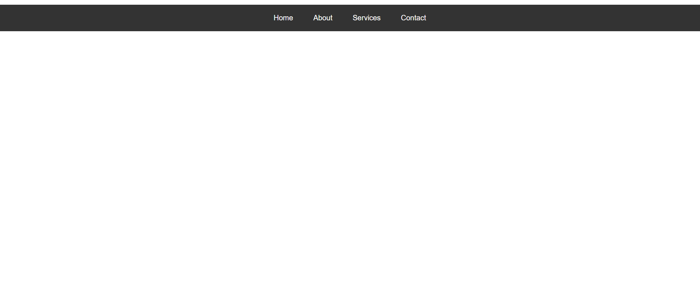

# prodigy info tasks 
 This is the internship tasks from the prodigy infotech 
 Task-1: Create an interactive navigation menu that changes color or style when scrolled or when hovering over a menu item. The navigation menu should have a fixed position and be visible on all pages. Use HTML to structure the menu, CSS to style it, and JavaScript to add interactivity, such as changing the background color or font color of the menu when it is scrolled or when a menu item is hovered over

 output:
 
 Task-2: To build a stopwatch web application, you can use HTML, CSS, and JavaScript. HTML is used to structure the elements of the application. By implementing functions for starting, pausing, and resetting the stopwatch, as well as tracking and displaying lap times, users can accurately measure and record time intervals. With these technologies and functionalities, you can create an interactive and user-friendly stopwatch web application.

 output:
        
 

 Task-3: To build a tic-tac-toe web application, you can use HTML, CSS, and JavaScript. By implementing functions to handle user clicks, track game state, and check for winning conditions, you can create an interactive and engaging tic-tac-toe game. With these technologies and functionalities, users can play against each other or against an AI opponent, aiming to get three markers in a row to win the game.

 output:

 Task-4: Build a personal portfolio website that showcases your skills, projects, and accomplishments as a web developer. Design an attractive and visually appealing layout that captures visitors' attention. Include a home page with a captivating headline, professional photo, and summary of your skills. Provide an "About Me" section with a detailed background, education, and professional experience.

 output: 
 
 Task-5: Build a web page that fetches weather data from a weather API based on the user's location or a user-inputted location. Display the current weather conditions, temperature, and other relevant information.

 output:
 

